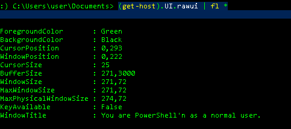

# Overview

Working Repo for the Preso: 'PowerShell to the People'  

## PowerShell Lessons Learned from an InfoSec Guy

### Abstract

0-60 course over PowerShell and how I use it for every day tasks in InfoSec.  I plan to go over high level topics that would have helped me in the beginning and then take everyone for a ride into what this shell has to offer.

## Presentation Outline

1. Basics I wish I knew early on
    * Verb-noun wat?!  Syntax caveats and ways around
    * man for windows? Yeah, finally! 
    * Get-member - and why I tend to run this at least once a day.
    * format outputs - cuz you can
    * what tha $_,?,%, $?,"`n" etc
2. PowerShell Profiles
    * What they are
    * How to use and my use cases
    * Walk through mine
3. Never open ADUC again!  ADTools to the rescue!
    * How many active user objects
    * How many domain admins
        * admincount=1 caveats
    * compare some user to group memberships
    * stale passwords or no password needed for [ADObjects](https://blogs.technet.microsoft.com/russellt/2016/05/26/passwd_notreqd/)
4. Automate IR
    * Tickle outlook, use case, code, and demo
5. Show the Power of the Shell  <--time permitting
    * add-type to add custom types  
        * dll load and call
        * You like your C# so much, run in PS!

## Rundown

1. Basics
    * cmdlet naming convention
        * Does seem bloated at first, but can become more natural feeling  
        * verb-noun.ps1 construct
            * approved verb list (get-verb - seriously will list approved verbs...)
            * You don't have to conform - use case
                * All the internal PS scripts for my internal compX usages starts like this:
                    `CompXGet-Computer.ps1`
                * That way tab completion worked for internal commands, your IDE will get mad..
    * get-help - man for Windows
        * man seems to be a built in alias now for get-help...
        * search for name of cmdlet, function, script, or workflow in the first parameter 
            * If you explicity state it, it goes to it
            * If not, it searches help topic titles
                * if not found then show topics that include that word
    * get-member - exploring objects
        * I use this extensively to see what methods are available for an object
            * What is the type of the object
            * What are the property values
    * format output options
        * the many ways, from csv, xml, windows form type, list, table, etc
            * convertto-csv, convertto-xml, out-gridview, format-list, format-table, out-host

2. PowerShell Profiles
    * Like in Bash, but PS has it too!
        * some configuration required - depedning on how you are accessing PS
            * VSCode has a path
            * ISE has a path
            * PS Terminal has a path..
        * Luckily there is a common default path, for current user:
            `$home\Documents\WindowsPowerShell\profile.ps1` 
          * New PSCore profile path:  
            `$home\Documents\PowerShell\Microsoft.PowerShell_profile.ps1`  
        * Must Change Execution Policy to Work - I use RemoteSigned
          `set-executionpolicy remotesigned` 
          * PSCore already was set to this..  
    * Lets go through the profile setting
        * Set Alias's you like  
        * color that console
        * update paths

3. PS AD Tools - **tested only on 2016 functional domain**
    * Why use a GUI when all the power of ADUC is in PS ADTools
        * It scales and is quicker to get results.
    * Find the functional level of the domain with one commandlet!  
        * `get-adrootDSE` or like this `(Get-ADRootDSE).domainFunctionality`
    * Who has a password to never expire in your domain?  
        * `get-aduser -Filter "PasswordNeverExpires -eq 'True'"`
        * Or even if they do not require a [password](https://blogs.technet.microsoft.com/russellt/2016/05/26/passwd_notreqd/)!
            * `Get-ADUser -Filter 'useraccountcontrol -band 32' -properties * | ft samaccountname,enabled,lastlogindate,PasswordLastSet`
            * Or like this now: `Get-ADUser -Filter 'PasswordNotRequired -eq $True'`
        * What about those stale passwords?  Checks if older than 180 days:
            * `get-aduser -Filter "enabled -eq 'True'" -properties * | where {$_.passwordlastset -le (get-date).adddays(-180)}`
    * Get the number of service accounts, if you have a naming standard that requires svc- at the first of the name
        * `(get-aduser -filter "samaccountname -like 'svc-*'").count`

4. Ticklin' the .Nets - Incident Response Use Case
    * Situation, had to manually update .msg file to send a phishing/malware removal request
        * too cumbersome and the perfect job for PowerShell
    * send-malwareMail to the rescue!
        * sadly no adoption because could not validate the email template before sending
        * even dumping the message to standard out didn't help, wants GUI...
    * enter, tickling the Outlook API!!
        * Pops open an outlook message allowing to modify via GUI before sending
        * more easily adopted and accepted by others in IR

5. Advanced Ops
    * Are you so attached to your C# you can't give it up?
    * Wanna add that DLL?
    * Run solely in memory?  

6. Questions
    * Code and references found in this repo.
    * `IEX (New-Object Net.Webclient).DownloadString(“https://raw.githubusercontent.com/lawlz/PSToThePeople/master/getStuff.txt”)`

# Setup Notes

## Local AD Environment Setup  

~~~
get-service winrm | start-service
winrm help config
winrm get winrm/config
winrm get winrm/config/client
winrm get winrm/config/server
winrm set winrm/config/client @{trustedhosts="prd-dc1"}
ping prd-dc1
notepad C:\windows\system32\drivers\etc\hosts
$creds = Get-Credential
enter-pssession -ComputerName prd-dc1 -Credential $creds -Authentication negotiate -UseSSLNegotiate -Verbose -UseSSL
winrm enumerate winrm/config/resource
winrm enumerate winrm/config
~~~

WinRM can be difficult to setup.  Had to enable the [winrm quickconfig](https://4sysops.com/wiki/enable-powershell-remoting/)  
This link help create the [HTTPS listener](https://www.visualstudiogeeks.com/devops/how-to-configure-winrm-for-https-manually)  
Once you configure the cert, take note of the cert thumbprint and add to your client trust store:  
    `$cert = gci Cert:\LocalMachine\My\$CertThumbprint`  
    `Export-Certificate -Cert $cert -FilePath "C:\Users\Administrator\Documents\newCert" -Type cert`  
I then mounted the C$ share and copied down the cert that I exported above.  
The final fix was to run PS with *elevated* creds from client [side Powershell](https://serverfault.com/questions/337905/enabling-powershell-remoting-access-is-denied/568228#568228)
If your local computer is not part of your test domain, you need to run as a domain user, first grab those creds:  
    `$creds = get-credential`  
As a non-domain joined PC all I could seem to do was pssession remoting with this command: 
    `enter-pssession $DCHostName -Authentication negotiate -Credential $creds -UseSSL`  
I didn't want to add my machine to this domain, since it is local VM on this same machine.  
However, in order to use tools like ServerManager.exe and others, you have to have a trust established to make it work easily...

## RSAT Install Issue with 1809  
Install RSAT, now a 'Feature On Demand' but the GUI sucks and never really installs for me...
[I had to use DISM to do it](https://docs.microsoft.com/en-us/windows-hardware/manufacture/desktop/dism-capabilities-package-servicing-command-line-options)  
First get the list of capabilities online.  
`dism /online /get-capabilities`  
Then copy the name and add it to the capabilityName param  
`dism /add-capability /online /CapabilitYName:"Rsat.ActiveDirectory.DS-LDS.Tools~~~~0.0.1.0`  
Add some remote management tools as well, may not be needed:  
`dism /add-capability /online /CapabilitYName:Rsat.RemoteAccess.Management.Tools~~~~0.0.1.0`

## PowerShell Profile - Colorization Fix and More
Due to the issues below, I moved to PSCore from PowerShell 5.1...  [More Info Here](https://docs.microsoft.com/en-us/powershell/scripting/install/installing-powershell-core-on-windows?view=powershell-6) on how to install PSCore.  This is the cross platform PowerShell and everyone should look to start moving this direction.    
* Install the MSI, I used 6.2.3, latest stable at the time.  7 is out in preview...  
  * I didn't check the psremoting box during install.  I am thinking it may be more allowing than I like..  Not sure yet, to be continued..  
* New profile path for PowerShell core:  
`~\Documents\PowerShell\Microsoft.PowerShell_profile.ps1`  
* By default It was not there...  Run these two commands:  
`new-item -path ~\Documents\ -name PowerShell -ItemType Directory`  
`copy-item C:\<pathTo>\Microsoft.PowerShell_profile.ps1 -Destination ~\Documents\PowerShell`  
* now restart the PS Session.  
* as admin run the following.  
The first one is to add the PSGallery, not trusted by default.  Since anyone pretty much can commit to this repo, keep untrusted and allow ad hoc.  
`Install-Module PowerShellGet –Repository PSGallery –Force`  
* This command will then install the latest PSReadline from the gallery.  
`Install-Module -Name PSReadLine -AllowPrerelease -verbose -scope AllUsers -force`  
* Validate all is installed with the latest PSReadline, mine is version "2.0.0-rc2".  
`Get-InstalledModule psreadline | fl *`

**PSReadLine Profile Colorization Issues, even with new install of 1903**  

Best source found on this, to me it helps explain why I am having troubles with this, plainly... https://devblogs.microsoft.com/commandline/new-experimental-console-features/   
Other references to some newer issues submitted, mostly blaming PSReadline as the place to fix:  
[1]: https://github.com/PowerShell/PowerShell/issues/7812    
[2]: https://github.com/PowerShell/PowerShell/issues/7037   
This feature may be something to look into, since I believe this is related to the 'newer' API as opposed to the old API I am using in the profile wrapping `$host.ui.rawui`.  
Feature link to look into: https://github.com/microsoft/terminal/issues/1796   
I don't like to download additional tools, but I keep seeing a reference to ColorTools for PS:  
https://devblogs.microsoft.com/commandline/introducing-the-windows-console-colortool/  
Repo:  https://github.com/microsoft/terminal/tree/master/src/tools/ColorTool  

***Previous PSReadLine troubleshooting notes***  
You only need to do the above steps mentioned in the PowerShell Profile section above.    
* doing a remove module fixes my colorizations:
  * `remove-module psreadline`  
  * However, you do lose all the great things in PSReadline, like copy/paste, history, etc.  
* They have patched this in Beta2.0.0.4 for me.  I tried the RC2 and it is giving me a weird colorization error:  

* Its a very odd behavior but after running this command you could once again pass strings to the version param as opposed to creating "system.Version" type using  `[system.version]::new()`  
  * `Install-Module PowerShellGet –Repository PSGallery –Force`  
  * Then restart restart your PS session.  Maybe reboot, TODO - Update me!
It was stating that the module was not in a valid module path, which it was in two places.  
List the contents of each currently loaded PSModulePath in $env:  
`($env:PSModulePath).split(";") |foreach { gci -Verbose $_}`
It also had an error that I need to run as admin, when I was indeed doing that.  Reboot definitely fixed this one...
* Now you can run these commands to get the beta version working:  
  * `Install-Module -Name PSReadLine -AllowPrerelease -verbose -scope AllUsers -force`  
  Maybe delete this next one:
  * `import-module -Name psreadline -MinimumVersion 2.0.0 -Force`  
* References to this issue, and still fighting it in 1903:  
    [1]: https://github.com/MicrosoftDocs/PowerShell-Docs/issues/2688  
    [2]: https://github.com/lzybkr/PSReadLine/issues/818  
    [3]: https://github.com/lzybkr/PSReadLine/issues/774  
    [4]: https://github.com/Microsoft/console/issues/276  
    [5]: https://github.com/microsoft/terminal/issues/372  
* Another issue on the latest referencing RawUI is the old API... Need to get with the new?  
    [6]: https://github.com/PowerShell/PSReadLine/issues/1110

## References

Automatic variables to call - [good ol' built-ins](https://docs.microsoft.com/en-us/powershell/module/microsoft.powershell.core/about/about_automatic_variables?view=powershell-6)  

More information about the [powershell profile](https://docs.microsoft.com/en-us/powershell/module/microsoft.powershell.core/about/about_prompts?view=powershell-5.1).

Great resource on converting C/C++ types (generally the way MS shows you in their dev docs) to [.net types powershell can use](http://www.pinvoke.net/).  

Great profile information with additional PS Profile links at the bottom of [page](https://blogs.technet.microsoft.com/askpfeplat/2018/06/25/powershell-profiles-processing-illustrated/)  

### BlueTeam Resources  
[Some common commands to know](https://github.com/sans-blue-team/blue-team-wiki/blob/gh-pages/Tools/PowerShell.md)  
[Nice little repo of scripts.](https://github.com/WiredPulse/PowerShell)  

# Ignore?

These last sections are mainly used as information for CFP input and can be ignored.

## Overview

The goal of this presentation is to share knowledge about PowerShell that would be valuable for anyone that wants to learn more, no matter what level of PowerShell foo you are at.  The ultimate hope is that everyone walks away with use cases and tools they could use today.  

First I will walk through some tips, tricks and how to's, mainly things I wish I knew when I started using PowerShell.  Then I will go over some automation use cases of where you could save time using PowerShell for incident response or even just to quickly gather AD configuration data.  It is all possible in this shell.

## Outline

1. get-help - we all need it..
2. PS has a .profile?!  And how I use it.
3. Never use ADUC again - Powershell AD Tools and the cool things therein
4. send-malwareMail.ps1 <– IR Automation Use Case
5. You like your C# code that much, lets add-type   <-- Time permitting

## Reference

[Github repo link to follow along](https://github.com/lawlz/PSToThePeople)

## Bio

Passionate and paranoid information technology professional, who also loves to serve the community.  Been in IT for over 15 years, with almost 10 years of that in Information Security. I have been fortunate enough to have had the opportunity to work on just about everything there is to do in InfoSec, with some deep knowledge in SIEM and reverse/forward web proxy technologies. My current focus is on infrastructure and endpoint automation mostly for hardening and resiliency purposes.

Passionate and paranoid infosec professional, who loves to serve the community.  Worked in IT Ops for over 15 years, 10 of that in InfoSec.